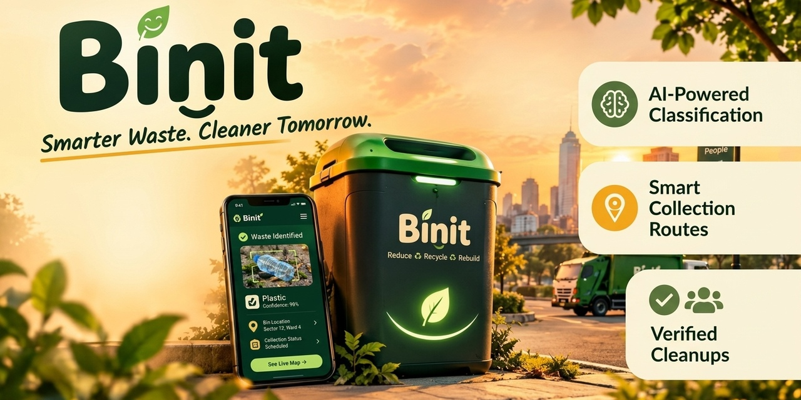

<p align="center">
  
</p>

# 🌿 BinIt (`binit.civic`)
> **AI-Powered Geospatial Civic Waste Management Platform**  
> *Transforming citizen photo reports into automated municipal dispatch & verified clean-up loops.*

<p align="center">
  <a href="https://nextjs.org/"></a>
  <a href="https://fastapi.tiangolo.com/"></a>
  <a href="https://python.org/"></a>
  <a href="https://www.typescriptlang.org/"></a>
  <a href="https://maplibre.org/"></a>
  <a href="https://tailwindcss.com/"></a>
</p>

---

## 🌟 Overview

**Binit** bridges the gap between everyday citizens and municipal sanitation crews. When a citizen spots an illegal dump or overflowing bin, they snap a photo. In under two minutes, Binit:
1. **Classifies Waste with Computer Vision**: Identifies materials across 11 categories (plastics, organic, hazardous, construction debris, etc.).
2. **Scores Civic Urgency**: Evaluates environmental risk factors such as proximity to open water bodies, arterial roads, and drain clog hazards.
3. **Optimizes Collection Routes**: Generates turn-by-turn routes via OSRM for hydraulic compactor trucks in urban wards and electric e-rickshaws (*Totos*) in village alleys.
4. **Enforces Proof-of-Cleanup**: Closes the loop with mandatory before-and-after photographic verification.

---

## 🗺️ Dual-Zone Architecture

Binit is purpose-built to handle two distinct administrative realities:

- **🏙️ Kolkata Urban Zone (`KOLKATA_URBAN`):**
  - High-density commercial packaging waste, street sweepings, and road litter.
  - Multi-lane road networks served by compactor trucks and transfer stations.
  - Default Center: `[88.3639° E, 22.5726° N]` (Park Street, Salt Lake, Gariahat).

- **🌾 Rajarhat Gram Panchayat Zone (`GRAM_PANCHAYAT`):**
  - Canal (*khal*) embankments, village ponds (*pukur*), and agricultural runoff.
  - Narrow unpaved tracks navigated by agile electric e-rickshaws and winches.
  - Default Center: `[88.5122° E, 22.6105° N]` (Bishnupur GP).

---

## 👥 4 Stakeholder Roles (Included Demo Personas)

| Role | Interface | Key Capabilities |
|---|---|---|
| **Citizen** | Mobile-first Portal | Submit photo reports in < 2 min, auto-GPS lock, track resolution, earn civic points. |
| **Operator** | Live Triage Hub | Review AI classifications, override categories, monitor backlog, dispatch collection routes. |
| **Worker / Crew** | Field Navigation | Turn-by-turn collection navigation, real-time stops, upload cleanup proof photos. |
| **Admin** | Municipal Analytics | City-wide MTTR / MTTT metrics, ward performance benchmarks, audit logs, role management. |

---

## 🏗️ System Architecture

```
┌────────────────────────────────────────────────────────────────────────┐
│                        Binit Logical Architecture                      │
├────────────────────────────────────────────────────────────────────────┤
│ Client: Next.js 14 App Router, TypeScript, Tailwind CSS, MapLibre GL   │
├────────────────────────────────────────────────────────────────────────┤
│ API Layer: FastAPI (Python 3.11), Async SQLAlchemy, JWT / Role RBAC    │
├────────────────────────────────────────────────────────────────────────┤
│ Services: Severity Scoring Matrix, OSRM Trip Optimizer, AI Classifier  │
├────────────────────────────────────────────────────────────────────────┤
│ Storage: Privacy-preserving EXIF Stripping, WebP Thumbnails, SQLite/S3 │
└────────────────────────────────────────────────────────────────────────┘
```

---

## 🚀 Quickstart (Local Development)

### Prerequisites
- **Node.js** 18+ and `npm`
- **Python** 3.11+

---

### 1. Backend Setup (`apps/api`)

```bash
# Navigate to api folder
cd apps/api

# Create and activate virtual environment
python -m venv .venv

# Windows:
.venv\Scripts\activate
# Linux/macOS:
source .venv/bin/activate

# Install dependencies
pip install -r requirements.txt

# Create .env from example (comes pre-configured for local development)
cp .env.example .env

# Run FastAPI server
uvicorn app.main:app --reload --port 8000
```

- API Base: `http://localhost:8000`
- Interactive Swagger Docs: `http://localhost:8000/docs`

---

### 2. Frontend Setup (`apps/web`)

```bash
# In a new terminal, navigate to web folder
cd apps/web

# Install dependencies
npm install

# Create .env from example
cp .env.example .env

# Start Next.js development server
npm run dev
```

- Web App: `http://localhost:3000`

---

## 🧪 Testing

Run backend test suite:
```bash
cd apps/api
pytest
```

---

## 📁 Repository Structure

```
.
├── apps/
│   ├── api/                     # FastAPI Backend
│   │   ├── app/
│   │   │   ├── ai/              # Computer Vision classifier adapters
│   │   │   ├── api/v1/          # Endpoints (auth, reports, map, routes, admin)
│   │   │   ├── core/            # Config, DB connection, geospatial math, security
│   │   │   ├── models/          # SQLAlchemy async ORM models
│   │   │   ├── schemas/         # Serializers and Pydantic DTOs
│   │   │   ├── services/        # State machine, severity scoring, notifications
│   │   │   └── storage/         # Local / S3 image storage & thumbnailing
│   │   ├── Dockerfile           # Backend container definition
│   │   └── requirements.txt
│   └── web/                     # Next.js 14 Web Application
│       ├── app/                 # App Router pages (landing, citizen, operator, worker, admin)
│       ├── components/          # Reusable UI & MapLibre components
│       └── lib/                 # API client, auth state, and map helpers
├── docs/                        # Architecture, PRD, TRD, AI, Database & Deployment Specs
│   ├── DEPLOY.md                # FastAPI Cloud & Vercel deployment guide
│   └── ...
└── README.md
```

---

## 🚢 Deployment

For complete deployment instructions on **FastAPI Cloud (Backend)** and **Vercel (Frontend)**, please see [docs/DEPLOY.md](./docs/DEPLOY.md).

---

## 📄 License
Built for civic impact and hackathon demonstrations.
