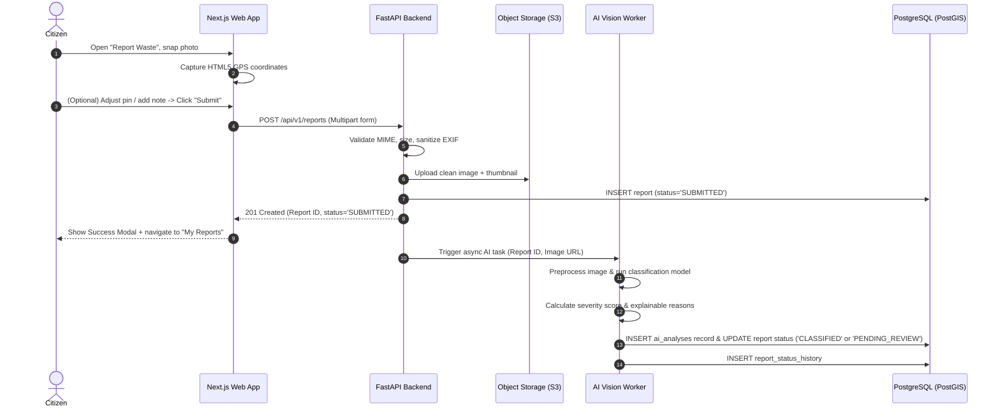
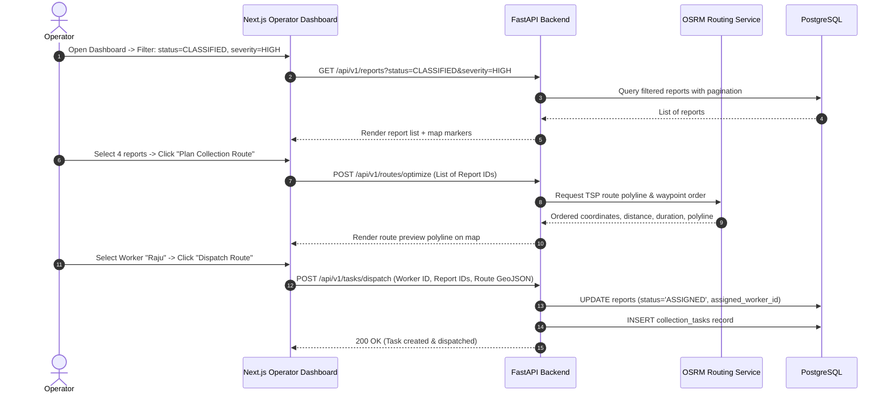
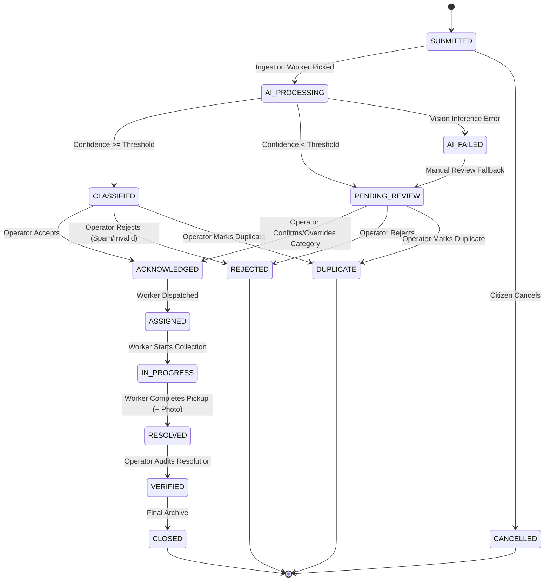

# Binit — Product Requirements Document (PRD)

> **Version:** 1.0  
> **Status:** Draft — Implementation Ready  
> **Date:** 2026-09-19  
> **Tagline:** *Smarter Waste. Cleaner Tomorrow.*  
> **Secondary Tagline:** *Spot It. Snap It. Solve It.*

---

## Table of Contents

1. [Executive Summary](#1-executive-summary)
2. [Product Vision](#2-product-vision)
3. [Problem Statement](#3-problem-statement)
4. [Inspiration & Philosophy](#4-inspiration--philosophy)
5. [Product Goals](#5-product-goals)
6. [Non-Goals (MVP)](#6-non-goals-mvp)
7. [Target Users & Detailed Personas](#7-target-users--detailed-personas)
8. [Role-Based Access Control (RBAC)](#8-role-based-access-control-rbac)
9. [User Problems & Solution Mapping](#9-user-problems--solution-mapping)
10. [Core Product Principles](#10-core-product-principles)
11. [MVP Scope & Priority Matrix](#11-mvp-scope--priority-matrix)
12. [Functional Feature Requirements](#12-functional-feature-requirements)
13. [User Stories](#13-user-stories)
14. [Key User Flows](#14-key-user-flows)
15. [Report Lifecycle & State Machine](#15-report-lifecycle--state-machine)
16. [AI Classification Requirements](#16-ai-classification-requirements)
17. [Explainable Severity System](#17-explainable-severity-system)
18. [Location Intelligence & GIS](#18-location-intelligence--gis)
19. [Management & Operational Dashboard](#19-management--operational-dashboard)
20. [Smart Collection & Route Planning](#20-smart-collection--route-planning)
21. [Analytics & Environmental Intelligence](#21-analytics--environmental-intelligence)
22. [Notification System](#22-notification-system)
23. [Privacy, Data Governance & Security](#23-privacy-data-governance--security)
24. [Future Roadmap](#24-future-roadmap)
25. [Success Metrics (Product & Technical)](#25-success-metrics-product--technical)
26. [Risk Register & Mitigation](#26-risk-register--mitigation)
27. [Assumptions & Engineering Decisions](#27-assumptions--engineering-decisions)
28. [Testable Acceptance Criteria](#28-testable-acceptance-criteria)
29. [Hackathon MVP Strategy (Demo vs. Production)](#29-hackathon-mvp-strategy-demo-vs-production)
30. [End-to-End Demo Scenario](#30-end-to-end-demo-scenario)

---

## 1. Executive Summary

Binit is an AI-powered smart waste management and environmental intelligence platform designed to transform how cities identify, classify, locate, prioritize, manage, and analyze waste-related issues.

Traditional urban municipal waste management operates in a fragmented, delayed, and reactive mode. Overflowing bins, unsegregated trash piles, and illegal dumpsites persist without real-time tracking or operational accountability. Binit bridges the gap between civic observation and municipal execution by turning citizen photos into structured, actionable environmental data.

When a citizen captures an image of waste via the Binit web application, the platform automatically captures geographic coordinates, executes an AI computer vision pipeline to categorize the waste and calculate a classification confidence score, applies an explainable multi-signal severity scoring engine, geo-tags the issue on a shared map, and dispatches it through a transparent lifecycle state machine to waste management operators and collection teams.

**Primary Objectives:**
- Provide a zero-friction, mobile-responsive citizen reporting interface (< 2 minutes from observation to submission).
- Deliver automated waste classification across 11 standardized categories with explicit confidence estimation.
- Provide operators with an operational control center featuring real-time map visualization, severity filtering, workload dispatch, and basic route generation.
- Establish an auditable data pipeline suitable for municipal environmental analytics and hotspot detection.

---

## 2. Product Vision

### 2.1 The Short-Term Vision (MVP)
Establish a reliable, closed-loop vertical slice:
`Citizen Spot & Snap -> AI Analysis & Severity -> Geospatial Mapping -> Operator Management -> Worker Collection -> Analytics & Civic Feedback`.

### 2.2 The Long-Term Vision
Transform Binit into a comprehensive urban environmental intelligence network combining:
- Citizen civic reporting
- Autonomous AI vision & drone inspection
- Smart bin telemetry (IoT fill-level, weight, temperature)
- Predictive waste accumulation models based on seasonality and foot traffic
- Multi-vehicle dynamic route optimization
- Extended environmental tracking (water body contamination, illegal industrial dumping, air/cleanliness metrics)

```
[ Citizen Smartphone Camera ] + [ IoT Smart Bins ]
                   │
                   ▼
       [ Ingestion & Validation ]
                   │
                   ▼
     [ AI Computer Vision Engine ]
                   │
                   ▼
 [ Geospatial & Severity Intelligence ]
                   │
                   ▼
   [ Automated Dispatch & Routing ]
                   │
                   ▼
 [ Municipal Environmental Intelligence ]
```

---

## 3. Problem Statement

### 3.1 Critical Challenges in Urban Waste Management

| Problem Area | Current Failure Mode | Impact |
|---|---|---|
| **Detection & Reporting** | Relies on manual telephone complaints or periodic patrol routes. | Days to weeks before municipal authorities become aware of illegal dumpsites. |
| **Data Quality** | Citizens provide vague text descriptions without standardized categorization. | Incorrect equipment or collection teams dispatched. |
| **Prioritization** | All complaints treated with uniform urgency or FIFO queue. | Toxic/hazardous waste or blocked stormwater drains sit unresolved while minor litter is serviced. |
| **Routing & Collection** | Collection trucks follow static, predetermined routes regardless of real waste distribution. | Excessive fuel consumption, high carbon emissions, unserviced overflowing hotspots. |
| **Accountability & Trust** | Citizens experience a "black hole" where complaints disappear without status updates. | Civic apathy, declining citizen engagement, worsening public cleanliness. |
| **Systemic Intelligence** | No centralized spatial analytics identifying chronic repeat dumping areas. | Inability to enact targeted municipal policies, CCTV placement, or extra bin deployment. |

---

## 4. Inspiration & Philosophy

Binit is guided by the philosophy:
> *"Turn environmental observations into structured, actionable intelligence."*

The platform moves municipal operations through the 8-stage progression:
```
1. SPOT     -> Citizen identifies an environmental issue.
2. SNAP     -> Citizen captures photographic and location evidence.
3. ANALYZE  -> Server validates, normalizes, and inspects image content.
4. CLASSIFY -> Computer vision infers material category and confidence.
5. LOCATE   -> GIS subsystem maps precise coordinates, address, and spatial context.
6. PRIORITIZE-> Rule engine calculates an explainable severity score.
7. MANAGE   -> Operators triage, acknowledge, schedule, and assign tasks.
8. IMPROVE  -> Longitudinal analytics reveal systemic hotspots and optimization areas.
```

---

## 5. Product Goals

### 5.1 Primary Functional Goals
- **G-1 (Rapid Reporting):** Enable any authenticated citizen to photograph, review location, and submit a waste report in under 120 seconds.
- **G-2 (Automated AI Classification):** Automatically classify uploaded images into one of 11 defined waste categories with an associated confidence score (0.0 to 1.0).
- **G-3 (Confidence Transparency):** Mark predictions below a configurable threshold as `NEEDS_REVIEW` to maintain operational trust.
- **G-4 (Explainable Prioritization):** Compute an objective severity level (`LOW`, `MEDIUM`, `HIGH`, `CRITICAL`) accompanied by human-readable justification reasons.
- **G-5 (Spatial Visibility):** Render an interactive map for citizens and operators showing clustered markers, heatmaps, and spatial filtering.
- **G-6 (Closed-Loop Lifecycle):** Enforce a strict state machine transition model from `SUBMITTED` to `CLOSED` with complete audit trails.
- **G-7 (Operational Dispatch):** Enable operators to bundle reports, plan collection routes via OSRM, and assign tasks to workers.

---

## 6. Non-Goals (MVP)

To ensure delivery of a robust, production-grade core architecture during the hackathon, the following are explicitly marked as **Non-Goals for MVP**:

- **Hardware IoT Integrations:** No physical ultrasonic/infrared bin sensor firmware integration (simulated schemas only).
- **Complex Multi-Vehicle Routing Problem (VRP) Solvers:** No multi-depot dynamic traffic optimization algorithms (standard point-to-point OSRM TSP/route generation is used).
- **Predictive ML Time-Series Forecasting:** No historical time-series forecasting models for future waste generation.
- **Gamification Tokenomics/Cryptocurrency:** No blockchain tokens or financial redemption systems (pure point/status tier modeling deferred to Phase 2).
- **Native Mobile Binaries:** No standalone iOS App Store / Google Play Store native compilations (responsive PWA-ready Next.js Web App is utilized).
- **Direct SMS / WhatsApp Gateway Integration:** In-app notification center and email triggers only for MVP.

---

## 7. Target Users & Detailed Personas

```
┌─────────────────────────────────────────────────────────────┐
│                    Binit User Ecosystem                     │
├──────────────┬──────────────┬───────────────┬───────────────┤
│   Citizen    │    Worker    │   Operator    │ Municipal Adm │
│ (Observation)│ (Collection) │(Triage/Route) │  (Analytics)  │
└──────────────┴──────────────┴───────────────┴───────────────┘
```

### Persona A: The Urban Citizen (Priya, 28)
- **Role:** `CITIZEN`
- **Context:** Urban resident and professional living in Salt Lake / Park Street, Kolkata.
- **Goals:** Quickly report garbage dumps along daily commute and residential streets; track resolution progress without bureaucratic friction.
- **Pain Points:** Lack of feedback after filing complaints; cumbersome municipal forms asking for 20+ fields.
- **Permissions:** Create report, view own reports, view public map (approximate location), cancel own unassigned report.

### Persona B: The Rural / Gram Panchayat Citizen (Subrata, 34)
- **Role:** `CITIZEN`
- **Context:** Village resident and farmer in Rajarhat Bishnupur Gram Panchayat (North 24 Parganas, West Bengal).
- **Goals:** Report illegal plastic and chemical dumping near village ponds (*pukur*), canals (*khal*), and agricultural roads.
- **Pain Points:** Remote location without regular municipal garbage trucks; waste dumped into irrigation channels goes unnoticed for months.
- **Permissions:** Create report, view own reports, view public map, track local panchayat cleanup actions.

### Persona C: The Field Waste Collector (Raju, 35)
- **Role:** `WORKER`
- **Context:** Sanitation worker or contracted e-rickshaw (*Toto*) / municipal compactor collection crew in Kolkata / Gram Panchayat zones.
- **Goals:** Know exact locations, waste types, and safety hazards before arriving at a site; easily mark tasks completed.
- **Pain Points:** Paper manifests, vague verbal instructions, arriving at sites with incorrect equipment for hazardous waste.
- **Permissions:** View assigned tasks, view route sequence, update task status (`IN_PROGRESS`, `RESOLVED`), upload proof-of-work photos.

### Persona D: The Operations Supervisor (Sunita, 42)
- **Role:** `OPERATOR`
- **Context:** Ward/Panchayat-level waste management supervisor overseeing Kolkata urban wards and Gram Panchayat zones.
- **Goals:** Monitor live incoming waste reports, verify low-confidence AI predictions, group reports into collection routes, dispatch workers.
- **Pain Points:** Information overload, inability to identify chronic duplicate complaints, lack of route coordination tools.
- **Permissions:** View all reports, acknowledge/reject/reclassify reports, assign tasks to workers, generate route plans, mark duplicates.

### Persona E: The Municipal / Panchayat Administrator (Anand, 54)
- **Role:** `ADMIN`
- **Context:** Municipal Authority (Kolkata Municipal Corporation / KMC) and Panchayat Executive Officer.
- **Goals:** Identify city and rural hotspots, evaluate ward/panchayat resolution times, assess recycling and segregation compliance.
- **Pain Points:** Inconsistent manual Excel reports, lack of real-time auditability, inability to justify equipment budget allocation across rural vs. urban sectors.
- **Permissions:** Full read/write access, system configuration, AI confidence threshold tuning, user role management, system audit logs, full analytics exports.

---

## 8. Role-Based Access Control (RBAC)

| System Resource / Action | CITIZEN | WORKER | OPERATOR | ADMIN |
|---|:---:|:---:|:---:|:---:|
| Submit Waste Report | ✅ | ❌ | ✅ | ✅ |
| View Own Reports & Status | ✅ | ✅ | ✅ | ✅ |
| View All City Reports (Full Detail) | ❌ | ❌ | ✅ | ✅ |
| View Public Map (Fuzzed/Aggregated) | ✅ | ✅ | ✅ | ✅ |
| View Operational Map (Exact Coordinates) | ❌ | Assigned Only | ✅ | ✅ |
| Override AI Waste Classification | ❌ | ❌ | ✅ | ✅ |
| Acknowledge / Reject Reports | ❌ | ❌ | ✅ | ✅ |
| Mark Report as Duplicate | ❌ | ❌ | ✅ | ✅ |
| Assign Reports to Workers | ❌ | ❌ | ✅ | ✅ |
| Update Status (`IN_PROGRESS` / `RESOLVED`) | ❌ | Assigned Only | ✅ | ✅ |
| Verify & Close Reports | ❌ | ❌ | ✅ | ✅ |
| Generate Route Optimizations | ❌ | ❌ | ✅ | ✅ |
| Access Municipal Analytics Dashboard | ❌ | ❌ | ✅ | ✅ |
| Manage User Roles & Permissions | ❌ | ❌ | ❌ | ✅ |
| Configure System & AI Thresholds | ❌ | ❌ | ❌ | ✅ |
| View Full System Audit Logs | ❌ | ❌ | ❌ | ✅ |

---

## 9. User Problems & Solution Mapping

```
[ Problem: Delayed Awareness ]      ──► [ Solution: Instant Mobile Photo & GPS Ingestion ]
[ Problem: Unknown Waste Material ]  ──► [ Solution: Multi-Class Vision Classifier ]
[ Problem: Inefficient Prioritization]─► [ Solution: Explainable Multi-Factor Severity Engine ]
[ Problem: Redundant Dispatches ]    ──► [ Solution: Geospatial & Temporal Duplicate Detection ]
[ Problem: Random Driving Routes ]   ──► [ Solution: OSRM-Powered Multi-Stop Route Generation ]
[ Problem: Citizen Distrust ]        ──► [ Solution: Real-Time Lifecycle Audit Log & Updates ]
```

---

## 10. Core Product Principles

1. **Evidence-Based Ground Truth:** Every report must possess cryptographically verified or validated photographic and geospatial coordinates.
2. **AI as an Assistant, Not an Arbiter:** AI provides instant classification and scoring, but humans retain full override capabilities and uncertainty is transparently surfaced.
3. **Radical Explainability:** Black-box scores are strictly prohibited; every severity score and duplicate suggestion must expose concrete, human-readable reasons.
4. **Privacy-by-Design:** Citizen locations are generalized on public views, and all photographic EXIF metadata is stripped prior to public serving.
5. **Decoupled Provider Architecture:** AI models, GIS base layers, geocoders, routing engines, and storage providers sit behind clean abstract interfaces.

---

## 11. MVP Scope & Priority Matrix

Features are classified into standard functional priorities:
- **P0 (Mandatory for MVP):** Essential core vertical slice.
- **P1 (High Priority):** Operational enhancements and optimization tools.
- **P2 (Post-MVP / Roadmap):** Advanced expansions.

| Module | Feature Description | Priority |
|---|---|:---:|
| **Auth & Profile** | Clerk authentication integration (JWT verification, RBAC mapping) | **P0** |
| **Reporting** | Citizen photo upload, automatic GPS capture, map pin adjustment | **P0** |
| **Image Pipeline** | MIME validation, EXIF stripping, thumbnail generation, S3 upload | **P0** |
| **AI Inference** | 11-category classification, confidence scoring, `NEEDS_REVIEW` fallback | **P0** |
| **Severity Engine** | Multi-factor rule-based scoring (0–100 score, Low–Critical rank, human reasons) | **P0** |
| **Report Lifecycle** | State machine enforcement (`SUBMITTED` -> `CLOSED`), audit history | **P0** |
| **Map & GIS** | MapLibre GL map, color-coded severity markers, marker clustering | **P0** |
| **Operator Triage** | Filterable report queue, AI override, worker assignment | **P0** |
| **Worker Portal** | Task list, detail with navigation link, mark resolved with photo | **P0** |
| **Analytics** | Summary KPIs, category pie charts, severity distribution, hotspot map | **P0** |
| **Route Planning** | Multi-stop OSRM route calculation and polyline map display | **P1** |
| **Duplicate Engine**| Spatial-temporal-category heuristic duplicate flagger | **P1** |
| **Notifications** | In-app notification center for status change events | **P1** |
| **IoT Smart Bins** | Telemetry ingestion and real-time fill level monitoring | **P2** |
| **Predictive ML** | Waste generation prediction and seasonal demand forecasting | **P2** |
| **Gamification** | Citizen cleanup badges, community leaderboards | **P2** |
| **i18n** | Multi-language localization (Hindi, Kannada, Marathi, Tamil) | **P2** |

---

## 12. Functional Feature Requirements

### 12.1 Authentication & Authorization (`AUTH`)
- **FR-AUTH-01:** System shall integrate with Clerk for authentication (Email, Password, Social OAuth).
- **FR-AUTH-02:** Backend shall validate Clerk-issued JWTs on all protected endpoints.
- **FR-AUTH-03:** Backend database shall maintain the authoritative role of each user (`CITIZEN`, `WORKER`, `OPERATOR`, `ADMIN`).
- **FR-AUTH-04:** Unauthenticated users shall only access public marketing landing pages and health endpoints.

### 12.2 Waste Reporting & Ingestion (`REPORT`)
- **FR-REP-01:** Authenticated citizens shall submit a report containing: 1 image file, latitude, longitude, optional location accuracy in meters, and an optional text description (max 1000 characters).
- **FR-REP-02:** Client shall attempt automatic HTML5 Geolocation capture upon opening report form.
- **FR-REP-03:** Client shall provide an interactive map allowing the citizen to drag the pin to adjust coordinates.
- **FR-REP-04:** System shall validate file size (max 10 MB) and MIME types (`image/jpeg`, `image/png`, `image/webp`).
- **FR-REP-05:** Server shall strip all EXIF metadata from uploaded images before persisting to storage.
- **FR-REP-06:** Report record shall be committed to the database in `SUBMITTED` state immediately upon receipt.

### 12.3 AI Computer Vision & Classification (`AI`)
- **FR-AI-01:** Ingestion shall trigger asynchronous AI classification.
- **FR-AI-02:** Classifier shall map the image into one of the 11 categories: `PLASTIC`, `PAPER`, `METAL`, `GLASS`, `ORGANIC`, `E_WASTE`, `TEXTILE`, `MIXED`, `HAZARDOUS`, `OTHER`, `UNKNOWN`.
- **FR-AI-03:** Classifier shall output a confidence score between `0.00` and `1.00`.
- **FR-AI-04:** If confidence is strictly less than the configurable threshold (default `0.70`), the report classification status shall be set to `NEEDS_REVIEW`.
- **FR-AI-05:** System shall persist inference metadata: `model_name`, `model_version`, `confidence`, `inference_time_ms`.
- **FR-AI-06:** Operators shall have the ability to override AI classification with audit logging.

### 12.4 Severity Engine (`SEV`)
- **FR-SEV-01:** System shall evaluate an objective severity score (0 to 100) using a transparent weighted rule formula.
- **FR-SEV-02:** Severity score shall map to categorical levels:
  - `0 - 30`: **LOW**
  - `31 - 60`: **MEDIUM**
  - `61 - 80`: **HIGH**
  - `81 - 100`: **CRITICAL**
- **FR-SEV-03:** The engine shall generate a list of explainable text reasons explaining the score.
- **FR-SEV-04:** Reports detected as `HAZARDOUS` waste category shall automatically have a minimum severity level of `HIGH` (minimum score of 70).

### 12.5 Geospatial & Map Visualization (`MAP`)
- **FR-MAP-01:** Web app shall render maps using MapLibre GL JS with OpenFreeMap / OSM vector/raster tiles.
- **FR-MAP-02:** Report markers shall be color-coded by severity:
  - `LOW` -> Green (`#10B981`)
  - `MEDIUM` -> Yellow/Amber (`#F59E0B`)
  - `HIGH` -> Orange/Red (`#EF4444`)
  - `CRITICAL` -> Purple/Dark Red (`#7F1D1D`)
- **FR-MAP-03:** Operator map shall support marker clustering and a toggleable density Heatmap layer.
- **FR-MAP-04:** Citizen map view shall blur exact coordinates to a ~100m neighborhood radius to protect residential reporter privacy.
- **FR-MAP-05:** Map view shall support multi-parameter filtering: Waste Category, Severity, Status, and Date Range.

### 12.6 Operator Queue & Dispatch (`OPS`)
- **FR-OPS-01:** Operator dashboard shall present a live, sortable queue of all active reports.
- **FR-OPS-02:** Operator can change report state to `ACKNOWLEDGED`, `REJECTED`, or `DUPLICATE`.
- **FR-OPS-03:** Operator can assign single or grouped reports to a designated `WORKER`.
- **FR-OPS-04:** Operator can select multiple reports and request an optimized route from OSRM.

### 12.7 Worker Execution (`WORKER`)
- **FR-WRK-01:** Workers shall have a dedicated "My Tasks" mobile view listing assigned jobs ordered by priority or route index.
- **FR-WRK-02:** Worker can transition status: `ASSIGNED` -> `IN_PROGRESS` -> `RESOLVED`.
- **FR-WRK-03:** Worker can optionally upload a resolution photo verifying that the waste was collected.

---

## 13. User Stories

### Citizen Stories
- **US-CIT-01:** *As a citizen*, I want to sign in with one click so that I don't have to fill out repetitive registration forms.
- **US-CIT-02:** *As a citizen*, I want to snap a picture of an overflowing dumpster and have my GPS location tagged automatically so that I can submit a report in under a minute while walking to work.
- **US-CIT-03:** *As a citizen*, I want to see what category and severity the AI assigned to my report so that I understand how the system evaluated my concern.
- **US-CIT-04:** *As a citizen*, I want to check "My Reports" and see live status badges (`SUBMITTED` -> `ASSIGNED` -> `RESOLVED`) so that I know municipal authorities are taking action.

### Operator Stories
- **US-OPS-01:** *As an operator*, I want to view a prioritized queue sorted by severity so that hazardous or critical road-blocking waste is dispatched before minor litter.
- **US-OPS-02:** *As an operator*, I want to filter the map by category (`PLASTIC`, `ORGANIC`, `HAZARDOUS`) so that I can dispatch specialized collection vehicles.
- **US-OPS-03:** *As an operator*, I want the system to flag potential duplicate reports within 50 meters so that I don't send two separate trucks to the same pile.
- **US-OPS-04:** *As an operator*, I want to select 5 pending reports and generate an optimized driving route for my driver via OSRM.

### Worker Stories
- **US-WRK-01:** *As a worker*, I want a clean mobile list of today's assigned cleanup tasks so that I can navigate directly to problem sites.
- **US-WRK-02:** *As a worker*, I want to mark a task as `RESOLVED` and attach a completion photo so that my work is verified and recorded.

### Administrator Stories
- **US-ADM-01:** *As an administrator*, I want a city-wide analytics dashboard showing weekly report volumes, average resolution hours, and waste category distributions so that I can allocate seasonal municipal budgets.
- **US-ADM-02:** *As an administrator*, I want to inspect system audit logs to verify role changes, AI overrides, and worker dispatch times.

---

## 14. Key User Flows

### Flow 1: Citizen Waste Submission (End-to-End)


### Flow 2: Operator Triage & Dispatch


---

## 15. Report Lifecycle & State Machine

### 15.1 State Machine Diagram


### 15.2 Transition Table & Authorized Actors

| Current State | Target State | Authorized Actor | Validation / Prerequisite |
|---|---|---|---|
| `SUBMITTED` | `AI_PROCESSING` | `SYSTEM` | Automatic transition upon background task trigger. |
| `AI_PROCESSING` | `CLASSIFIED` | `SYSTEM` | Model output confidence >= `AI_CONFIDENCE_THRESHOLD`. |
| `AI_PROCESSING` | `PENDING_REVIEW` | `SYSTEM` | Model output confidence < `AI_CONFIDENCE_THRESHOLD`. |
| `AI_PROCESSING` | `AI_FAILED` | `SYSTEM` | Model timeout, corrupt buffer, or exception. |
| `CLASSIFIED` / `PENDING_REVIEW` | `ACKNOWLEDGED` | `OPERATOR`, `ADMIN` | Operator reviews image and confirms category. |
| `CLASSIFIED` / `PENDING_REVIEW` | `REJECTED` | `OPERATOR`, `ADMIN` | Requires rejection reason string. |
| `CLASSIFIED` / `PENDING_REVIEW` | `DUPLICATE` | `OPERATOR`, `ADMIN` | Requires linking to primary `parent_report_id`. |
| `ACKNOWLEDGED` | `ASSIGNED` | `OPERATOR`, `ADMIN` | Valid `worker_id` must be provided. |
| `ASSIGNED` | `IN_PROGRESS` | `WORKER` (Assigned), `OPERATOR` | Worker acknowledges site arrival. |
| `IN_PROGRESS` | `RESOLVED` | `WORKER` (Assigned), `OPERATOR` | Optional proof-of-work image attached. |
| `RESOLVED` | `VERIFIED` | `OPERATOR`, `ADMIN` | Supervisor verifies cleanup authenticity. |
| `VERIFIED` | `CLOSED` | `OPERATOR`, `ADMIN`, `SYSTEM` | Report finalized and archived. |
| `SUBMITTED` | `CANCELLED` | `CITIZEN` (Creator) | Citizen cancels before operator acknowledgment. |

---

## 16. AI Classification Requirements

### 16.1 Target Waste Categories
The system supports 11 standardized waste classes:

```
┌────────────────────────────────────────────────────────────────────────┐
│                        Standardized Categories                         │
├─────────────┬─────────────┬──────────────┬─────────────┬───────────────┤
│ 1. PLASTIC  │ 2. PAPER    │ 3. METAL     │ 4. GLASS    │ 5. ORGANIC    │
├─────────────┼─────────────┼──────────────┼─────────────┼───────────────┤
│ 6. E_WASTE  │ 7. TEXTILE  │ 8. HAZARDOUS │ 9. MIXED    │ 10. OTHER     │
├─────────────┴─────────────┴──────────────┴─────────────┴───────────────┤
│ 11. UNKNOWN (Fallback when visual ambiguity is total)                  │
└────────────────────────────────────────────────────────────────────────┘
```

### 16.2 Confidence & Uncertainty Management
- Every classification outputs a float confidence $C \in [0.00, 1.00]$.
- A system-wide configuration parameter `AI_CONFIDENCE_THRESHOLD` (default: `0.70`, configurable between `0.50` and `0.95`) determines routing.
- If $C < \text{threshold}$, the report is assigned status `PENDING_REVIEW` and flag `classification_status = NEEDS_REVIEW`.
- The user interface explicitly surfaces a badge: `"AI Suggestion: Plastic (62% Confidence - Review Required)"` rather than presenting an uncertain prediction as an absolute fact.

### 16.3 Model Metadata Retention
For every classification inference, the system persists:
```json
{
  "model_name": "hf-waste-vit-base-patch16",
  "model_version": "v1.2.0",
  "predicted_category": "PLASTIC",
  "confidence": 0.884,
  "secondary_categories": [
    {"category": "MIXED", "confidence": 0.082},
    {"category": "PAPER", "confidence": 0.021}
  ],
  "inference_time_ms": 142.5
}
```

---

## 17. Explainable Severity System

### 17.1 Mathematical Scoring Formula
The severity score $S \in [0, 100]$ is computed deterministically from 5 weighted components:

$$S = \min\left(100, \; S_{\text{category}} + S_{\text{quantity}} + S_{\text{proximity}} + S_{\text{duplicate}} + S_{\text{age}}\right)$$

Where:
1. **Base Category Score ($S_{\text{category}}$):**
   - `HAZARDOUS`: 70 pts (Hard minimum floor of 70)
   - `E_WASTE`: 50 pts
   - `MIXED`: 35 pts
   - `ORGANIC`: 30 pts (High vector for vermin/disease)
   - `PLASTIC` / `METAL` / `GLASS`: 25 pts
   - `PAPER` / `TEXTILE` / `OTHER` / `UNKNOWN`: 15 pts

2. **Estimated Visual Quantity ($S_{\text{quantity}}$):**
   - `LARGE` (Massive pile / blocked road): +20 pts
   - `MEDIUM` (Multiple trash bags / overflowing bin): +10 pts
   - `SMALL` (Single item / isolated litter): +0 pts

3. **Proximity & Environmental Sensitivity ($S_{\text{proximity}}$):**
   - Near water body (< 50m): +15 pts
   - Near major road / hospital / school (< 25m): +10 pts

4. **Duplicate & Hotspot Density ($S_{\text{duplicate}}$):**
   - $\ge 2$ unverified reports within 50m in past 48h: +10 pts

5. **Report Age Escalation ($S_{\text{age}}$):**
   - Unresolved $> 48$ hours: +5 pts
   - Unresolved $> 96$ hours: +10 pts

### 17.2 Explainable Reason Output Example
```json
{
  "severity": "HIGH",
  "severity_score": 75,
  "severity_reasons": [
    "Base score for category E_WASTE (+50 pts)",
    "Identified within 30m of sensitive stormwater drain (+15 pts)",
    "2 duplicate citizen reports logged in this area (+10 pts)"
  ]
}
```

---

## 18. Location Intelligence & GIS

### 18.1 Target MVP Geographical Coverage (Kolkata Urban & Gram Panchayat)
The MVP map and spatial intelligence explicitly focus on two complementary administrative environments in West Bengal:

```
┌────────────────────────────────────────────────────────────────────────┐
│                        MVP Dual-Zone Spatial Scope                     │
├────────────────────────────────────┬───────────────────────────────────┤
│ Zone 1: Kolkata Urban Area (KMC)   │ Zone 2: Gram Panchayat Area       │
│ • Focus: High-density urban litter │ • Focus: Rural/village dumping    │
│ • Default Center: 22.5726°N, 88.3639°E│ • Default Center: 22.6105°N, 88.5122°E│
│ • Areas: Salt Lake, Park Street,   │ • Areas: Rajarhat Bishnupur GP,   │
│   New Town, Shyambazar, Gariahat   │   Ponds (Pukur), Canals (Khal)    │
│ • Administration: Municipal Ward   │ • Administration: Gram Sansad/GP  │
└────────────────────────────────────┴───────────────────────────────────┘
```

- **Interactive Zone Switcher:** Both citizen and operator map interfaces feature a quick one-click viewport toggle between **"Kolkata Urban (KMC)"** and **"Gram Panchayat Zone"**.
- **Contextual Waste Patterns:**
  - *Urban (Kolkata):* High plastic packaging, commercial cardboard, beverage bottles, blocked street drains, overflowing compactor stations.
  - *Rural (Gram Panchayat):* Plastic and mixed waste dumping along agricultural canals (*khal*), village pond embankments (*pukur*), and unpaved village roads (*kacha rasta*).

### 18.2 Coordinate Precision & Storage
- Spatial coordinates are captured in standard WGS 84 (`EPSG:4326`).
- Storage utilizes PostGIS `GEOGRAPHY(Point, 4326)` columns indexed with spatial R-Tree GIST indexes.

### 18.3 Spatial Query Capabilities
- **Radius Search:** Retrieve all reports within $R$ meters of a point using `ST_DWithin`.
- **Bounding Box Search:** Retrieve all reports visible within the current viewport of the MapLibre canvas using `ST_MakeEnvelope`.
- **Administrative Zone Filter:** Filter by zone tag (`zone='KOLKATA_URBAN'` or `zone='GRAM_PANCHAYAT'`).
- **Hotspot Aggregation:** Spatial clustering via `ST_ClusterDBSCAN` or grid-based binning (`ST_SnapToGrid`) to compute geographic density heatmaps.

### 18.4 Privacy Layer
- To protect citizen privacy, public and general citizen map views blur report coordinates by snapping them to a 100-meter centroid or truncating coordinates to 3 decimal places (~110m accuracy).
- Only authenticated `OPERATOR`, `WORKER`, and `ADMIN` roles receive full 6-decimal precision coordinates for operational dispatch.

---

## 19. Management & Operational Dashboard

### 19.1 Dashboard Layout Architecture
```
┌────────────────────────────────────────────────────────────────────────┐
│  Binit Operations Center                               [Operator Profile]│
├─────────────────┬──────────────────┬─────────────────┬─────────────────┤
│ Total Reports   │ Pending Triage   │ High / Critical │ Resolved Today  │
│     1,248       │       38         │       14        │       42        │
├─────────────────┴──────────────────┴─────────────────┴─────────────────┤
│                                                                        │
│  [ Map View ]                                  [ Report Queue ]        │
│  ┌──────────────────────────────────────────┐  ┌─────────────────────┐ │
│  │                                          │  │ #842 High - E-Waste │ │
│  │      (Cluster 12)        [Pin: Red]      │  │ #841 Crit - Hazard  │ │
│  │                                          │  │ #840 Med - Plastic  │ │
│  │              [Pin: Orange]               │  │ #839 Low - Paper    │ │
│  │                                          │  │ #838 High - Mixed   │ │
│  └──────────────────────────────────────────┘  └─────────────────────┘ │
│                                                                        │
├──────────────────────────────────────┬─────────────────────────────────┤
│ Waste Category Distribution (Donut)  │ 7-Day Inflow vs. Resolution     │
│ [ Plastic 38% | Organic 24% | ... ]  │ [ Bar / Line Trend Chart ]      │
└──────────────────────────────────────┴─────────────────────────────────┘
```

### 19.2 Operational Controls
- **Bulk Selection:** Select multiple table rows or map pins to trigger batch status change or route creation.
- **Side Panel Drawer:** Click any report to slide out complete metadata: full-res image, AI raw probabilities, severity reasons, citizen text note, and transition buttons.

---

## 20. Smart Collection & Route Planning

### 20.1 MVP Route Generation Flow
1. Operator applies filter: `status=ACKNOWLEDGED`, `zone=Central`.
2. Operator selects up to 15 pending report waypoints.
3. System invokes the `RoutingProvider` (OSRM Traveling Salesperson / Route service).
4. System returns the optimal waypoint visiting sequence, total estimated distance (km), estimated duration (min), and a GeoJSON LineString polyline.
5. Operator inspects the route overlaid on the MapLibre map and assigns it to a worker.

---

## 21. Analytics & Environmental Intelligence

### 21.1 Core Metrics & Aggregations
- **Volume Metrics:** Inflow rate (reports/day), backlog count, resolution throughput.
- **Categorical Breakdown:** Percentage share of plastic vs. organic vs. hazardous waste across municipal wards.
- **SLA & Performance Metrics:** Mean Time to Triage (MTTT) and Mean Time to Resolution (MTTR).
- **Hotspot Recurrence Index:** Number of reports filed within 50 meters of the same coordinate within a 30-day window.

---

## 22. Notification System

### 22.1 In-App Notification Center (MVP)
The MVP implements a database-backed in-app notification center. Users receive real-time or polled badge updates for:
- Citizen: `Report #102 has been Analyzed (Plastic - High Severity)`
- Citizen: `Report #102 has been Assigned to Collection Crew`
- Citizen: `Report #102 is Resolved. Thank you for making the city cleaner!`
- Operator: `New CRITICAL Severity Report Filed near MG Road`
- Worker: `New Collection Route Assigned (4 Locations)`

---

## 23. Privacy, Data Governance & Security

### 23.1 Data Minimization & Privacy Protection
- **EXIF Sanitization:** All incoming binary images are stripped of EXIF tags (removing hardware serials, embedded thumbnail caches, and raw EXIF location tags).
- **Coordinate Fuzzing:** Public feeds and citizen-facing APIs fuzz coordinates to 3 decimal places.
- **Anonymized Civic Submissions:** Reporter identity (name, email) is never exposed on public map popups or shared feeds.

### 23.2 Data Retention Policy
- Open/Active Reports: Retained indefinitely until closed.
- Resolved Reports: Maintained in primary storage for 12 months, then moved to cold archive.
- Audit Logs: Retained for a minimum of 36 months for municipal compliance.

---

## 24. Future Roadmap

```
┌────────────────────────────────────────────────────────────────────────┐
│                        Binit Evolution Roadmap                         │
├───────────────────┬───────────────────┬────────────────────────────────┤
│ Phase 1 (MVP)     │ Phase 2 (P1)      │ Phase 3 (P2 / Enterprise)      │
├───────────────────┼───────────────────┼────────────────────────────────┤
│ • Core Reporting  │ • OSRM Routing    │ • IoT Bin Telemetry Ingestion  │
│ • AI Vision Model │ • Duplicate Engine│ • Multi-Vehicle VRP Optimizer  │
│ • PostGIS Map     │ • In-App Notifs   │ • Predictive Waste ML Models   │
│ • Operator Queue  │ • CSV/GeoJSON Exp │ • Gamification & Eco-Badges    │
│ • Basic Analytics │ • PWA Offline Sync│ • Regional Indian Languages    │
└───────────────────┴───────────────────┴────────────────────────────────┘
```

---

## 25. Success Metrics (Product & Technical)

### 25.1 Product Success Metrics (Targeted Benchmarks)
- **Time to Report:** Average time for a citizen to submit a report $< 90\text{ seconds}$.
- **Triage Automation Rate:** $> 80\%$ of submitted reports automatically classified with high confidence without requiring manual re-categorization.
- **Resolution Tracking:** $100\%$ of closed reports accompanied by valid status transition audit records.

### 25.2 Technical Success Metrics
- **API Performance:** p95 latency for non-upload endpoints $< 250\text{ ms}$.
- **AI Inference Latency:** Mean computer vision inference time $< 3.5\text{ seconds}$ on standard CPU/GPU worker instances.
- **Map Render Performance:** Smooth 60 FPS vector map panning with $1,000+$ clustered markers on screen.

---

## 26. Risk Register & Mitigation

| # | Risk Description | Impact | Likelihood | Mitigation Strategy | Fallback Plan |
|---|---|:---:|:---:|---|---|
| **R-1** | **AI Misclassification / Hallucination** | HIGH | MED | Implement strict confidence scoring and mark low-confidence items as `NEEDS_REVIEW`. | Operator manual override interface. |
| **R-2** | **Dark / Blurry / Corrupted Photos** | MED | HIGH | Client-side and server-side image validation; OpenCV blur detection. | Prompt citizen to retake photo or route to operator review. |
| **R-3** | **Spam / Malicious / Duplicate Flood** | HIGH | MED | Rate limiting per Clerk user ID; spatial-temporal duplicate clustering. | Operator bulk reject and automated duplicate linking. |
| **R-4** | **Map / Tile Provider Rate Limits** | MED | LOW | Use self-hosted or open vector tile endpoints (OpenFreeMap) behind abstract provider interfaces. | Fallback to raster OSM tile server. |
| **R-5** | **GPS Inaccuracy / Indoor Drift** | MED | HIGH | HTML5 accuracy checks; draggable pin on MapLibre interactive canvas. | Citizen manually adjusts pin to visible landmark. |
| **R-6** | **Cloud Storage Bandwidth Costs** | MED | MED | Sharp/Pillow server-side WebP compression and thumbnail generation (max 400px for previews). | Cache thumbnails via CDN. |

---

## 27. Assumptions & Engineering Decisions

1. **Authentication:** Clerk is selected for managed identity; application-level roles are stored authoritatively in the PostgreSQL database.
2. **PostGIS Inclusion:** Standard relational models are insufficient for radius, bounding box, and clustering queries; PostGIS is mandatory.
3. **Storage Architecture:** Raw images are never stored as binary BLOBs in PostgreSQL; S3-compatible object storage is used with signed URL generation.
4. **AI Layer Decoupling:** The backend communicates with an abstract `WasteClassifier` interface, enabling switching between local PyTorch models, Hugging Face endpoints, or mock classifiers without altering API contracts.
5. **Map Provider Independence:** Frontend uses MapLibre GL JS (open source) with provider-agnostic vector style specs.

---

## 28. Testable Acceptance Criteria

### Module: Citizen Report Submission
- `AC-REP-01`: Given an authenticated citizen, when they attach a 5MB JPEG and grant GPS permissions, the report form automatically populates coordinates with accuracy $\le 20\text{m}$.
- `AC-REP-02`: Given an image $>10\text{MB}$ or an invalid format (`.pdf`, `.exe`), the system immediately rejects the upload with HTTP 400 and a descriptive error message.
- `AC-REP-03`: When the report is submitted, the API returns HTTP 201 with a UUID `id` and status `SUBMITTED` within 2.5 seconds.

### Module: AI Inference Pipeline
- `AC-AI-01`: Given a submitted report, when the background inference runs on a clear image of plastic bottles, the system outputs category `PLASTIC` with confidence $\ge 0.70$ and sets status `CLASSIFIED`.
- `AC-AI-02`: Given an ambiguous or dark image yielding confidence $0.48$, the system records the category but sets `classification_status = 'NEEDS_REVIEW'` and transitions report to `PENDING_REVIEW`.

### Module: Operator Dispatch & Lifecycle
- `AC-OPS-01`: Given an operator viewing the queue, when they click "Acknowledge" on a classified report, the system transitions status to `ACKNOWLEDGED` and creates a `report_status_history` audit record with the operator's user ID.
- `AC-OPS-02`: Given a worker attempting to update a report not assigned to their user ID, the backend strictly returns HTTP 403 Forbidden.

---

## 29. Hackathon MVP Strategy (Demo vs. Production)

| Component | Hackathon MVP Demo Implementation | Production Deployment Target |
|---|---|---|
| **Identity** | Clerk Free Tier + SQLite/Postgres role mapping | Clerk Enterprise / Managed OIDC |
| **Database** | Supabase PostgreSQL 15 + PostGIS Extension | AWS RDS PostgreSQL + Multi-AZ PostGIS |
| **Object Storage**| Supabase Storage / Cloudflare R2 / Local MinIO | AWS S3 + CloudFront CDN |
| **AI Inference** | Integrated FastAPI PyTorch/HF pipeline or Mock | Celery / Redis asynchronous worker pool with GPU acceleration |
| **Routing** | Public OSRM Demo Server / Local OSRM instance | Self-hosted dedicated OSRM / Valhalla cluster |
| **Map Rendering**| MapLibre GL JS + OpenFreeMap vector styles | MapLibre GL JS + Custom Vector Tile Server (Protomaps/Planetiler) |

---

## 30. End-to-End Demo Scenario

### *"The Dual-Zone Cleanliness Journey (Kolkata Urban & Rajarhat Gram Panchayat)"*

#### Scene A: Urban Kolkata (Park Street / Salt Lake)
1. **Step 1 (Citizen Discovery):** Urban citizen Priya opens Binit on her smartphone near Park Street, Kolkata. She taps "Report Waste" and photographs a large commercial accumulation of plastic packaging and beverage cups blocking a sidewalk drain.
2. **Step 2 (Instant Submission):** GPS captures `(22.5512° N, 88.3524° E)`. Priya taps "Submit Report". System responds in $<2$ seconds with confirmation `#KMC-101` and status `SUBMITTED`.
3. **Step 3 (AI & Severity Evaluation):** AI vision model classifies `PLASTIC` (Confidence: `0.93`). Severity engine detects proximity to a primary roadway and blocked drainage, assigning `severity: HIGH (Score: 78)`.

#### Scene B: Rural Gram Panchayat (Rajarhat Bishnupur GP)
4. **Step 4 (Panchayat Citizen Discovery):** Village resident Subrata spots an illegal hazardous chemical/mixed dumping site along a canal (*khal*) embankment in Rajarhat Bishnupur Gram Panchayat `(22.6105° N, 88.5122° E)`.
5. **Step 5 (Submission & Urgent Severity):** Subrata submits photo `#GP-204`. AI identifies `HAZARDOUS / MIXED` (Confidence: `0.86`). Severity engine applies the mandatory environmental sensitivity rule for water body proximity ($+15$ pts), triggering `severity: CRITICAL (Score: 88)`.

#### Scene C: Operator Triage & Dynamic Dispatch
6. **Step 6 (Multi-Zone Dashboard):** Operator Sunita opens the Operations Center. Using the **Zone Switcher**, she inspects the live map:
   - Switches to **Kolkata Urban Zone**: Reviews `#KMC-101`, confirms AI classification, and queues it for compactor truck dispatch.
   - Switches to **Gram Panchayat Zone**: A red pulsating marker highlights `#GP-204`. Sunita immediately acknowledges the critical water hazard.
7. **Step 7 (OSRM Route Generation):** Sunita selects `#GP-204` along with 3 rural dump points. OSRM computes an optimized 6.8 km collection loop for the Panchayat's e-rickshaw (*Toto*) collection team. She dispatches to worker Raju.
8. **Step 8 (Worker Action & Resolution):** Raju follows the route on his mobile task screen, arrives at the canal site, cleans the dumping area, attaches a completion photo, and taps **Mark Collected**.
9. **Step 9 (Closed Loop & Analytics):** Subrata and Priya receive notifications: *"Your waste report has been resolved!"* The municipal analytics dashboard updates real-time KPIs across both KMC and Gram Panchayat sectors.

---
*End of Product Requirements Document (PRD)*
